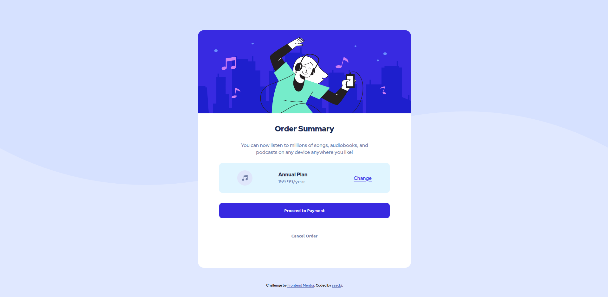

# Frontend Mentor - Order summary card solution

This is a solution to the [Order summary card challenge on Frontend Mentor](https://www.frontendmentor.io/challenges/order-summary-component-QlPmajDUj). Frontend Mentor challenges help you improve your coding skills by building realistic projects.

## Table of contents

- [Frontend Mentor - Order summary card solution](#frontend-mentor---order-summary-card-solution)
  - [Table of contents](#table-of-contents)
  - [Overview](#overview)
    - [The challenge](#the-challenge)
    - [Screenshot](#screenshot)
    - [Links](#links)
  - [My process](#my-process)
    - [Built with](#built-with)
    - [What I learned](#what-i-learned)
    - [Continued development](#continued-development)
  - [Author](#author)

## Overview

### The challenge

Users should be able to:

- See hover states for interactive elements

### Screenshot

### Links

- [GitHub repo](https://github.com/saacbj/OrderSummaryCard)
- [GitHub page](https://saacbj.github.io/OrderSummaryCard/)

## My process

### Built with

- HTML5 markup
- CSS custom properties
- Flexbox

### What I learned

For this challenge I focused on some properties of CSS such as relative units and the position property for the divs in conjunction with Flexbox.

### Continued development

A very important aspect of this project I'd like to improve in the future is the responsiveness of the layout and especifically the scalability of the svg elements.

## Author

- [GitHub](https://github.com/saacbj)
- Frontend Mentor - [@saacbj](https://www.frontendmentor.io/profile/saacbj)
